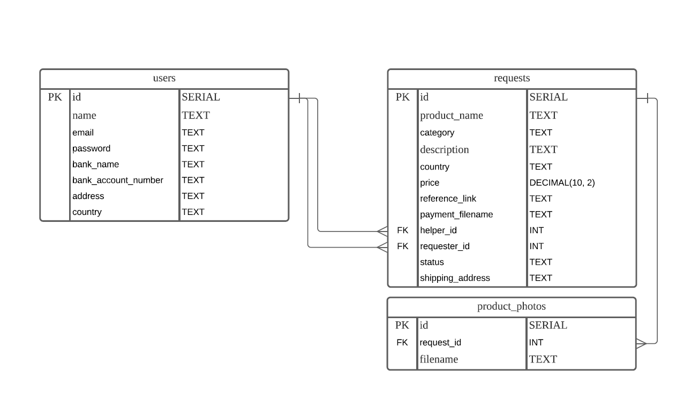

# Freight Buddy Mobile Front-end

Rocket Academy SWE1 Project 6

## [Go to App](https://snack.expo.io/@aljt/lightweightcoder_freight-buddy-mobile-frontend)

## Technologies used

- Database: PostgreSQL
- Back-end framework: Express (Node.js)
- Other technologies: Sequelize, Github, Heroku

## About

An app that allows people (requesters) to enlist the help of others (helpers) overseas to purchase products from those overseas countries and ship them to the requesters' country.

## ERD

## [Project Portfolio Site](https://lightweightcoder.github.io/portfolio/freight-buddy-mobile.html)

## [Front-end Repository](https://github.com/lightweightcoder/freight-buddy-mobile-frontend)
